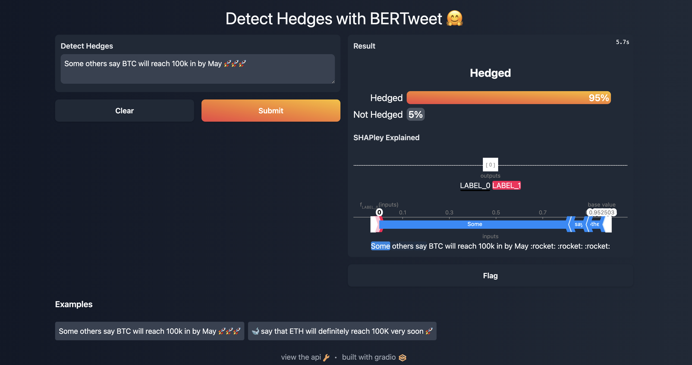

# Cryptocurrency Uncertainty Index

   

## Overview
Constructing a cryptocurrency index based on news-media texts using NLP to measure cryptocurrency uncertainty for downstream time series analysis
and forecasting of cryptocurrency volatility.

## Index Construction Approaches
1. Baseline Keyword Based Index ```(Lucey et al. 2021)```
2. Expanded Keyword Based Index with Latent Dirichlet Allocation recovered Topics
3. Hedge Based Uncertainty Index with BERTweet & Wiki Weasel 2.0

## Set-Up
Some simple steps to setting up the repository for ETL, Modelling, etc.

### Dependencies & Venv
```zsh
brew install make  # OSX
make install  # Runs Brew and Poetry Installs
make build # Builds Elasticsearch, Kibana & Postgres images from compose file
```

## Data & NLP Pipelines Documentation
All Data extraction, NLP modelling & inferences as well as Index construction pipelines can be called via the CLI interface. Please refer to the documentation below for details:
### Data Extraction
1. **Reddit data extraction via Pushshift**
* Extracts all subreddit comments and submissions data for a given list of ```subreddits``` over a period specified by ```start_date``` and ```end_date```. Note that data is extracted in batches by ```Year-Month``` to handle PushshiftAPI's (PMAW) connection drops / rate limits.
* Data is inserted into and analyzed by ```Elasticsearch``` under the ```reddit-crypto``` index by default and serialised locally in ```data/raw_data_dump/reddit``` as ```.pkl``` files.

  ```zsh
  Usage: cli.py extract-reddit-cry-data [OPTIONS]

    Extracts data from given subreddits for the specified date range.

  Options:
    --subreddits TEXT               Subreddits to pull data from  [default:
                                    ethereum, ethtrader, EtherMining, Bitcoin,
                                    BitcoinMarkets, btc, CryptoCurrency,
                                    CryptoCurrencyTrading]
    --start-date [%Y-%m-%d|%Y-%m-%dT%H:%M:%S|%Y-%m-%d %H:%M:%S]
                                    Start date  [default: 2014-01-01 00:00:00]
    --end-date [%Y-%m-%d|%Y-%m-%dT%H:%M:%S|%Y-%m-%d %H:%M:%S]
                                    End date  [default: 2021-12-31 00:00:00]
    --mem-safe / --no-mem-safe      Toggle memory safety. If True, caches
                                    extracted data periodically  [default: mem-
                                    safe]
    --safe-exit / --no-safe-exit    Toggle safe exiting. If True, extraction
                                    will pick up where it left off if
                                    interrupted  [default: no-safe-exit]
  ```
2. **Yahoo! Finance data extraction**
* Extracts all Yahoo! Finance Market Data for a given list of ```tickers``` over a period specified by ```start_date``` and ```end_date```.
* Data is inserted into a specified ```target-table``` in a postgres database.
  ```zsh
  Usage: cli.py extract-yfin-data [OPTIONS]

    Extracts ticker data from Yahoo Finance

  Options:
    --tickers TEXT       List of Asset Tickers  [default: BTC-USD, ETH-USD,
                        USDT-USD, XRP-USD, BNB-USD, ADA-USD, DOT-USD, LUNA-USD,
                        GC=F, ^GSPC]
    --start-date TEXT    Start date to begin extraction  [default: 2014-01-01]
    --end-date TEXT      End date to extract up till  [default: 2021-12-31]
    --interval TEXT      Granularity of data  [default: 1wk]
    --target-table TEXT  Postgres table to insert data to  [default:
                        asset_prices]
  ```
### Text Processing
1. **Text Processing / Analysis of Raw Reddit Data**
* Uses the ES' Reindex API to move and process existing raw data under ```reddit-crypto``` to the ```reddit-crypto-custom``` index using a ```Custom Analyzer``` to handle ```cryptocurrency``` and ```social-media``` specific terms and patterns. See ```es/custom_analyzers``` for details.
  ```zsh
  Usage: cli.py es-reindex [OPTIONS]

    ES reindexing from a source index to a destination index

  Options:
    --source-index TEXT  Source ES Index to pull data from  [default: reddit-
                        crypto]
    --dest-index TEXT    Destination ES Index to insert data to  [default:
                        reddit-crypto-custom]
    --dest-mapping TEXT  Destination index ES mapping
  ```

### NLP Tool Kit
1. **LDA Topic Modelling**
* Trains a LDA topic model using ```Gensim```'s Multicore LDA implementation optimized with variational Bayes.
  ```zsh
  Usage: cli.py nlp-toolkit train-multi-lda [OPTIONS]

    Train multiple iterations of LDA for various Num Topics (K)

  Options:
    --raw-data-dir TEXT             Directory containing csv files with
                                    processed data (sans tokenization)
                                    [default: nlp/topic_models/data/processed_re
                                    ddit_train_test/train]
    --gram-level TEXT               Unigram or Bigrams  [default: unigram]
    --num-topic-range <INTEGER INTEGER>...
                                    Lower and upper bound of K to try out
                                    [default: 1, 10]
    --num-topic-step INTEGER        Step size to increment K by within topic
                                    range  [default: 1]
    --num-workers INTEGER           Number of workers (CPU cores) to use for
                                    parallelization  [default: 7]
    --chunksize INTEGER             Size of training batches  [default: 10000]
    --passes INTEGER                Number of passes through the training corpus
                                    [default: 1]
    --alpha TEXT                    Alpha val for a priori topic - document
                                    distribution  [default: symmetric]
    --eta FLOAT                     Eta value. See Gensim docs
    --random-state INTEGER          Random seed  [default: 42]
    --save-dir TEXT                 Where to save relevant dict, model data for
                                    each run  [default:
                                    nlp/topic_models/models/lda]
    --trained-dict-save-fp TEXT     Location of saved dictionary for corpus.
                                    Specify to use pre-constructed dict.
    --trained-bigram-save-fp TEXT   Bigram Model Save directory
    --get-perplexity / --no-get-perplexity
                                    Whether to compute log perplexity on each
                                    model on a held out test set.  [default:
                                    get-perplexity]
    --test-data-dir TEXT            File path to test data dir to compute log
                                    perplexity on.  [default: nlp/topic_models/d
                                    ata/processed_reddit_train_test/test]
  ```

2. **Top2Vec Topic Modelling**
* Trains a Top2Vec topic model using joint word and document embeddings with the ```Doc2Vec``` algorithm (Default).
  ```zsh
  Usage: cli.py nlp-toolkit train-t2v [OPTIONS]

    Trains Top2Vec on a given corpus

  Options:
    --data TEXT                     Corpus data  [default: nlp/topic_models/data
                                    /processed_reddit_combined/crypto_processed_
                                    reddit_combined_10.csv]
    --min-count INTEGER             Minimum number of counts a word should have
                                    to be included  [default: 50]
    --speed TEXT                    Learning speed. One of learn, fast-learn or
                                    deep-learn  [default: learn]
    --num-workers INTEGER           Number of CPU threads to train model
                                    [default: 7]
    --embedding-model TEXT          Embedding model  [default: doc2vec]
    --umap-low-mem / --no-umap-low-mem
                                    Whether to use low mem for UMAP  [default:
                                    no-umap-low-mem]
    --hdb-min-cluster-size INTEGER  HDBSCAN min cluster size  [default: 100]
    --model-save-dir TEXT           Model save directory  [default:
                                    nlp/topic_models/models/top2vec]
  ```
3. **Finetune BERTweet Hedge Detector with Pop Based Training**
* Finetunes a ```Hugging Face``` model (```VinAI's BERTweet``` but can be changed) using SOTA ```Population Based Training``` with Ray Tune and logs models trained and hyperparameter sweep with ```Weights & Biases```.
  ```zsh
  Usage: cli.py nlp-toolkit pbt-hedge-clf [OPTIONS]

    Finetunes Hugging Face classifier using SOTA population based training

  Options:
    --model-name TEXT               Base huggingface hub transformer to finetune
                                    on.  [default: vinai/bertweet-base]
    --train-data-dir TEXT           Data directory containing csv train and test
                                    data for finetuning and eval in specified
                                    format.  [default: nlp/hedge_classifier/data
                                    /szeged_uncertainty_corpus/cleaned_datasets/
                                    train_test/wiki/csv]
    --model-save-dir TEXT           Model save directory location.  [default:
                                    nlp/hedge_classifier/models]
    --sample-data-size INTEGER      Amount of train and test data to use as a
                                    subsample for testing.
    --num-cpus-per-trial INTEGER    Number of CPUs to use per trial (Tesla A100)
                                    [default: 8]
    --num-gpus-per-trial INTEGER    Number of GPUs to use per trial (Tesla A100)
                                    [default: 1]
    --smoke-test / --no-smoke-test  Whether to run a smoke test.  [default: no-
                                    smoke-test]
    --ray-address TEXT              Ray address location. If None uses Local.
    --ray-num-trials INTEGER        Number of times to Randomly Sample a point
                                    in the Params Grid  [default: 8]
    ```

4. **Hedge Classifier Demo**

* Launches an App to ```demo``` a given Hedge (Text) Classifier with ```Gradio```.
* ```SHAPley``` values for Transformers are provided for error analysis / inspection.
  ```zsh
  Usage: cli.py nlp-toolkit hedge-clf-demo [OPTIONS]

    Launches a Gradio app for hedge classification demo.

  Options:
    --hf-model-name TEXT   Hugging Face Model to Load. Must be valid on Hugging
                          Face Hub.  [default: vinai/bertweet-base]
    --model-save-dir TEXT  Pretrained model save dir / checkpoint to load from.
                          [default: nlp/hedge_classifier/models/best_model]
    --theme TEXT           Gradio theme to use.  [default: dark-peach]
    ```


### Uncertainty Index Construction
1. **Build Keyword Uncertainty Index**
* Uses ```Lucey et al. (2021)```'s methodology to construct a baseline cryptocurrency index using a simple ```predefined keyword set```.
* Resulting numeric index values are inserted into the ```postgres``` and ```elasticsearch```.

  ```zsh
  Usage: cli.py build-ucry-index [OPTIONS]

    Construct crypto uncertainty index based on Lucey\'s methodology.

  Options:
    --es-source-index TEXT          ES Index to pull text data from  [default:
                                    reddit-crypto-custom]
    --start-date [%Y-%m-%d|%Y-%m-%dT%H:%M:%S|%Y-%m-%d %H:%M:%S]
                                    Start date  [default: 2014-01-01 00:00:00]
    --end-date [%Y-%m-%d|%Y-%m-%dT%H:%M:%S|%Y-%m-%d %H:%M:%S]
                                    End date  [default: 2021-12-31 00:00:00]
    --granularity TEXT              Supports day, week, month, year etc.
                                    [default: week]
    --text-field TEXT               Name of field to mine for index  [default:
                                    full_text]
    --type TEXT                     Index type. One of price or policy
                                    [default: price]
    --prefix TEXT                   Index name. One of lucey, lda or top2vec
                                    [default: lucey]
  ```

2. **Build Hedge Uncertainty Index**
*  Uses a trained ```Hugging Face``` text classifier to detect hedges in a given corpus and build an index.
*  Resulting numeric index values are inserted into ```postgres```.

    ```zsh
    Usage: cli.py build-hedge-index [OPTIONS]

      Construct hedge based crypto uncertainty index using HF transformer.

    Options:
      --data-source TEXT              Source data to perform hedge classification
                                      on.  [default:
                                      nlp/topic_models/data/processed_reddit]
      --start-date [%Y-%m-%d|%Y-%m-%dT%H:%M:%S|%Y-%m-%d %H:%M:%S]
                                      Start date  [default: 2014-01-01 00:00:00]
      --end-date [%Y-%m-%d|%Y-%m-%dT%H:%M:%S|%Y-%m-%d %H:%M:%S]
                                      End date  [default: 2021-12-31 00:00:00]
      --granularity TEXT              Supports day, week, month, year etc.
                                      [default: week]
      --hf-model-name TEXT            Valid Hugging Face Hub model name.
                                      [default: vinai/bertweet-base]
      --hf-model-ckpt TEXT            Path to tuned Hugging Face model config and
                                      weights  [default:
                                      nlp/hedge_classifier/models/best_model]
      --name TEXT                     Index name.  [default: bertweet-hedge]
    ```
### Services
* ```Elasticsearch``` & ```Kibana``` - For easy text analysis and lookup of data
* ```Postgres``` - Storing of all other relational data (E.g. cryptocurrency indicies, macroeconomic indicators, etc.)

**Make Commands**
```zsh
### Start Up Services ###
make run # After building docker images

### Health Check ###
make ps
make es-cluster-health

### Shutdown ###
make stop  # Stops docker containers
```
