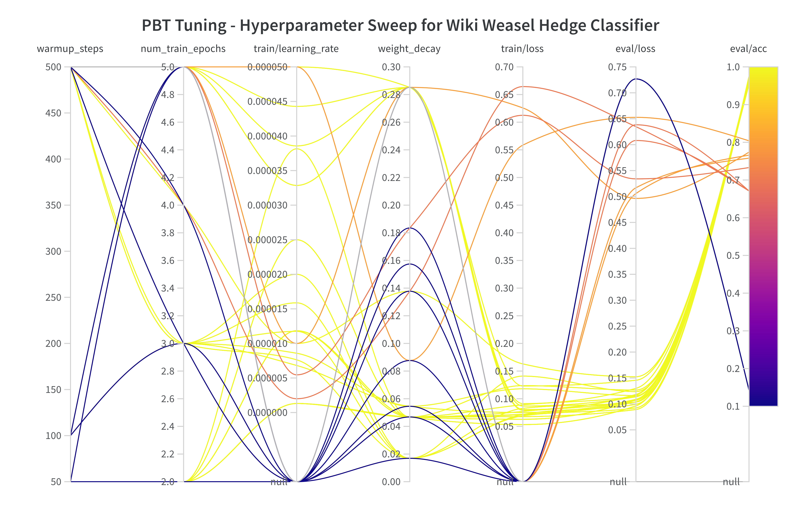

## [TO BE UPDATED] Linguistic Uncertainty Classifier (Hedge Classifier)
Here we seek to train and validate our hedge classifier using ML / DL / Transformer based models as a novel approach to constructing a cryptocurrency uncertainty index.

## Overview
1. ```Data```
   * Data for training and validating our models. Comprises
   * ```Szeged Uncertainty Corpus``` which contains the RAW wiki weasel and other corpuses for uncertainty modelling. See site [here](https://rgai.inf.u-szeged.hu/node/160).
   * PROCESSED ```Wiki Weasel``` corpus from ```xml``` for language modelling and classification. Courtesy of ```Pierre-Antoine Jean et. al. (2016)```. See repo [here](https://github.com/PAJEAN/uncertaintyDetection).
2. ```Models```
   * Model ```training scripts```, ```model weights & binariess``` and various ```Utils```
3. ```Results```
   * ```Weights & Biases``` Results report on hyperparameter tuning using SOTA Population Based Training Fine Tuning of ```BERTweet``` model on cleaned ```Wiki Weasel``` corpus. See [here](https://wandb.ai/chrisliew/huggingface/reports/Population-Based-Training-for-Hedge-Classification--VmlldzoxNjYxNDA1?accessToken=9osf6099au0gojyquf2d1ov39ins5haj0tc9xuqggak7f8e5k0or5ctpeny7jjen).


